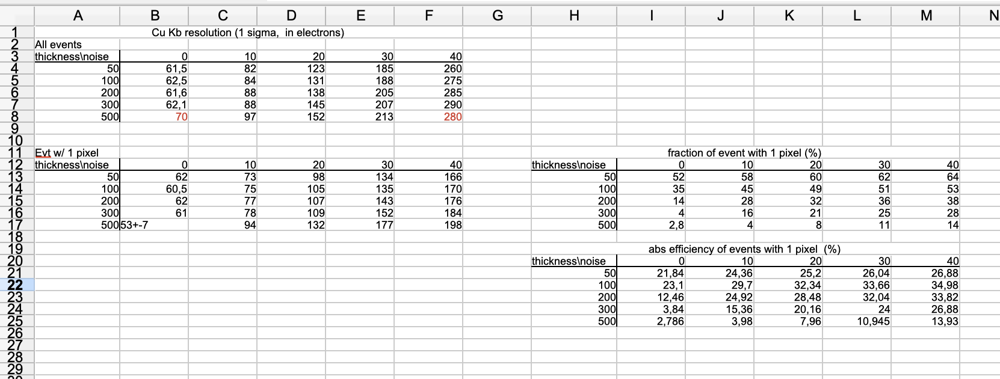

# Solid state detector for X-rays (ASIX)

The followind logbook contains informations about the solid state detector to be implemented as an upgrade of the GPD for X-rays.  
Instead of the gas as conversion stadium, a solid state conversion stadium will be inserted. 

### ASIX proposal review

- Goal: This proposal aims at establishing new X-ray detection systems with simultaneous optimal imaging and spectral capabilities. Position and energy resolution shall be better than:
- 10 𝝻m
- 300 eV, at a maximum global readout rate of 100kHz and energy range of 1-50 keV. 

The ASIX systems will implement a hybrid structure combining:
- a core front-end, large area CMOS ASIC with 50𝝻m pitch hexagonal pixels featuring
signal triggering and smart processing logic;
- a customized silicon sensor with appropriate geometry for mating with the ASIC pixels;
- a simple, robust electro-mechanical integrated assembly.

The multiplication does not occur as in gas detectors. Signal pixels are few, less than 10. 
The main parameters in a detector like this one are the following:
- width of the SSCS (Solid State Conversion Stadium);
- noise of the readout chip (that is, by now, XPOL-III);
- Fano factor, that limits the energy resolution toghether with noise. 

Having no multiplication of signal, the detector is no more in barely noiseless conditions as in the GPD.  
**Noise sums in quadrature** and is no longer as tiny wrt single pixel signal as in GPD case. (signal is the sum of pixel signals). 
The range of particles is a lot shorter than the gas case. 

This chip will have different applications from IXPE, in particular can be used for crystals and in general material analysis. For this tasks, event rate should increase dramatically (of some orders of magnitudes).

Because of those main issues, the characteristics to be tuned opportunely are:
- keeping noise as low as possible;
- higher chip readout.

First task: resolve K-lines of copper. Those lines are at:
- 8.046 keV (principal K-$\alpha$ line)
- 8.904 keV (principal K-$\beta$ line)

It is desirable to divide the Ka1+Ka2 from the Kb1+Kb3+Kb5. $\Delta E \simeq 880$ eV.  

Note that resolving the lines is not only an hardware tuning, the **reconstruction can be tuned for obtaining peak division**. 

## Event physics 
As previously described, this detector works using photoelectric effect of $\gamma$ on the silicon detector.  
The physics with zero noise is easy to compute:  
Being $E_{K\beta} = 8900$ eV, it is easy to compute the mean number of electron-holes pair created by the photoconversion: $<e> = \frac{E_{K\beta}}{E_{ion}} \pm \sqrt{\frac{E_{K\beta}}{E_{ion}} \cdot F}= 2472 \pm 17$ [$e-$]  
(in Si, where $E_{ion}=3.6$ eV and $F\simeq 0.128$).  

This results in the following energy resolution in eV: $R = <e> \cdot E_{ion} = 60$ eV. 

The principal noise effect is due to _charge sharing_.  
With _charge sharing_ it is intended the process of diffusion of the cloud in the medium that cause the electrons to trigger the bordering pixels to the one (or more) where the cloud was formed.  
This effect damages signal because the electronic noise sums in quadrature:
$$\sigma_{tot} = \sqrt{\sum_{i=1}^{N_{signal}}(\sigma_{<e>} + \sigma_{electronics})^2} $$  

Where:
- $\sigma_{<e>}$ is the uncertainty due to statistical fluctuations ($\sigma_{<e>} = 17$ [$e-$]);
- $\sigma_{electronics}$ depends on chip readout and it is measured in ENC (Equivalen Noise Charge = signal charge in electrons that determines a $\frac{S}{N} = 1$).

## Analysis of MC events - defining the interesting metrics

Main idea is starting from any reconstruction algorithm and searching for hardware tuning (searching for physical parameters of the detector). After hardware tuning, the reconstruction algorithm can be changed in order to find the most efficient. 

The parameters of the simulation regard the silicon detector:
- _thickness_ ($t$) of the silicon detector (ranges from 50 $\mu m$ to 500 $\mu m$);
- _pitch_ ($p$) of the readout custom chip, that defines the size of every hexagonal pixel (ranges from 50 $\mu m$ to 100 $\mu m$).  
Remember that we use hexagonal grids as we can see in the figure below.  
So, if we call pitch $p$ the _vertical spacing_, then the pitch in _horizontal direction_ is $\frac{\sqrt{3}}{2}\cdot p$ (For further reading, see: [hexagon_grid_link](https://www.redblobgames.com/grids/hexagons/));  

- _noise_ ($N$) of every pixel in the readout custom chip [ENC].

The tradeoff to find regards the parameters $t$ and $p$.  
A low **thickness** $t$ implies a _lower photon efficiency_ but an higher thickness implies an _higher charge sharing_, that means _higher noise_.  
A low **pitch** $p$ implies higher granularity of the readout and so signals of more pixels, that could be useful for reconstruction of direction (for polarimetry) but could be dispersive in terms of energy reconstruction.  

The useful metrics for measuring the goodness of the detector are:
- energy resolution $R = \frac{\Delta E}{E}$ and _effective energy resolution_ (?);
- rejection power ($RP$) for now defined as: $$RP =\frac{\text{number of } \gamma \text{ identified as contamination}}{\text{number of } \gamma \text{ that are contamination}}$$
This quantity is more interesting than the _fraction of contamination_ because it is properly normalized. ASK BALDINI 
- quantum efficiency $QE$:
$$QE = \frac{\text{ number of emitted } e-}{\text{number of incident }\gamma}$$
Note that this is slightly different from the _photoabsorption efficiency_ of a material, that is the probability that a single photon is absorbed via photoelectric effect.
- signal noise ratio $\frac{S}{N}$;

- fraction of events with a single signal pixel wrt ALL EVENTS:
$$f_{1px} =N_{1px} \cdot \frac{\epsilon_{\gamma}}{N_{detected}}$$
Where:  
-> $N_{1px}$ is the number of event detected with 1 signal pixel;  
-> $\epsilon_{\gamma}$ is the photoabsorption associated with the silicon detector (dependent for its thickness);  
-> $N_{detected}$ is the number of detected events.

### Interesting plots by now
- selecting events by number of signal pixels, looking at how the mean and the sigma of the distribution of peaks change;
- plot of noise vs thick vs energy resolution

## What to do next?
- Redo computations of Carmelo and Luca: [x]
 

    Measures done for both $K_{\alpha}$ and $K_{\beta}$. Plots to be done:
    - Colormap thick-noise-relative variation wrt true energy value [x] (understand how to plot more colormaps together);
    - Colormap thick-noise-$\frac{FWHM}{\mu}$ [x].
    - Add numbers in the heatmaps [x]

## Hexsample simulation grid 
The parameter space taken into consideration is _thickness-ENC-pitch_.

Where:
- _thickness_ is a feature of the solid state detector;
- _ENC_ and _pitch_ are features of the readout custom chip.

In order to represent 2D plots, the 3 possible couples of parameters has been exploited, fixing the third parameter to a reasonable value (often conservative ones).

### thickness-ENC space 
First goal is to understand for which parameters it is possible to divide the $\alpha$ and $\beta$ peaks, then, we want a resolution that can divide 880 eV. 

Because of that, the first quantity to look at is the energy resolution (in eV).  
Fixing pitch at 50 $\mu \text{m}$.

As measure of the energy resolution, we consider the FWHM of the fitted Gaussian peak for the energy, that is $\text{FWHM} = \sigma_E \cdot 2.35$ .

In the following two figures, it is shown the FWHM for all events and events with a single pixel. 

As expected:
- __proportional to thickness__ ;
- __proportional to ENC__.  
- It is higher for $\alpha$ peak but it is fine bc those are absolute resolutions, $K_{\alpha}$ has a larger peak.

It is necesary to set a metric and a limit for the _contamination_ of $K_{\alpha}$ on $K_{\beta}$ (or vice-versa but I think this is more incisive).

It improves for 1px tracks as expected. 

#### $\Delta = \frac{\mu_E - E_k}{E_k}$, shift of the mean from true value 

In the following heatmaps, the trend for the shift of the mean from its true value is shown. In the first picture, the one for the 1px events, in the latter the one for all events: 

This figure shows the effect of the zero suppression on tracks, as a matter of fact, the zero suppression threshold is proportional to noise value: `zero_threshold = noise*SIGMA_THRESHOLD`, where `SIGMA_THRESHOLD` is set to 2.  
This means that a part of the tracks of 1px have not completely collected the charge in a single px, instead, have lost part of the charge in another px that has been successively zero suppressed; clearly this effect is bigger for high thickness because in that case diffusion is higher and so there are few 'real' 1px tracks.  
This could give a measure of how many tracks are effectively of 1px (assuming that this is the only contribution to mean shift, that seems reasonable and assuming that the charge lost is `zero_threshold * 0.5`, just mediating dumbly the value).

At 30 ENC (that seems the limit for our electronics), we have:  
`zero_threshold` = 60 $e-$ = 60*3.6 eV = 216.0 eV .  
$\frac{216}{E_{K_\alpha}} = 27 \%$ , $\frac{216}{E_{K_\beta}} = 24 \%$

So, a rough estimation of the 'false' 1px events could be the following:  
- $\alpha$: $f = \frac{0.024}{0.027} = 88 \%$ for $t = 500$ $\mu\text{m}$, where 0.024 come from simulations;
- $\beta$: $f = \frac{0.018}{0.024} = 75 \%$ for $t = 500$ $\mu\text{m}$, where 0.018 come from simulations.  

Those clearly are overestimates because we are assuming that all tracks lose the maximum that they can. 

The hypotesis that the shift of the mean can be explained by this phenomenon is confirmed by the trend of the mean cluster size shown below:

As we can see, the mean cluster size shrinks as noise and thickness grows, this is counterintuitive in terms of the physics but makes sense when we consider the zero suppression effect. 

As another proof, looking at the shift of the mean for all events, we can see that this effect is suppressed: 

That means that the effect of the tracks cut by zero suppression is mediated and approaches zero.  
This makes sense because the events with a single pixel are << number of total events, as we can see below:

#### Fraction of events of 1px

### thickness-pitch space 
In the following grid of parameters, ENC value has been set. $\text{ENC} = 40$ enc.  

contributo di fano + contributo elettronico  