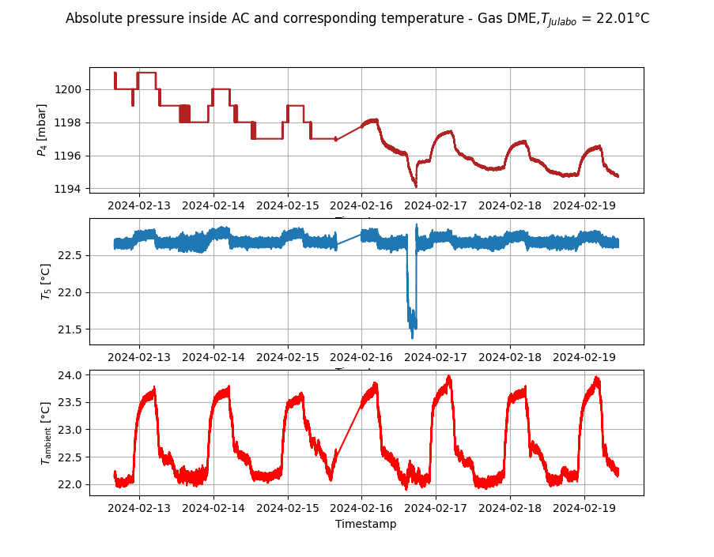
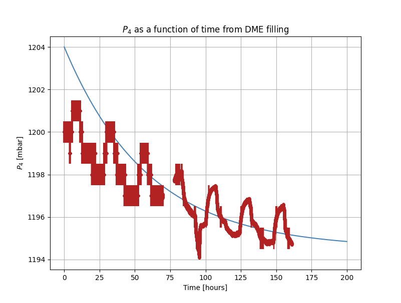
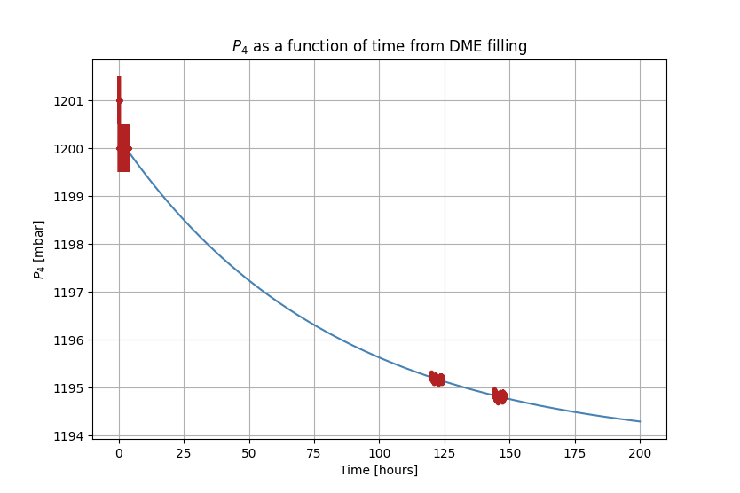
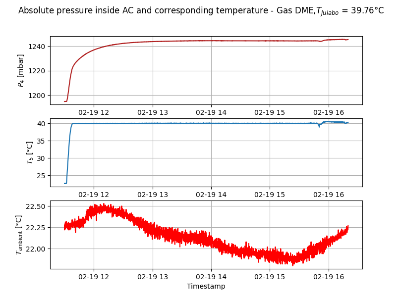
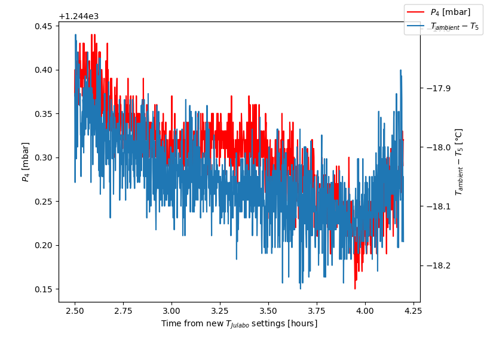

# Resinated GPD cob7 - HV scan changing pressures for secular pressure trends
NB: cob = chip on board (XPOL-III)

## Tests in Ar (17/03/2023)
### Pressure-Gain curve
1. Sampling some preassure values (4-5) and doing an HV scan for every P
2. After HV scan, fixing gain (~10000-15000 adc) for a long run (0.5-1 h) with fixed preassure  
The gain is expected to double every ~20 V.  
Fluctuation in energy resolution is expected to diminuish as the gain increases (see Tavernier for recap)
3. Energy resolution, ROI size could be interesting parameters when we fix P and gain and confront with MC. 
4. Deciding if redoing the test in DME and at which workpoint (at that point, polarization prestations can be evaluated)

### Procedure for tests 

1. VME ON
2. FPGA programming insertion (_n.sof)
3. charge injection for trigger test (for seeing if still 'alive')
4. HV ON with python hvcontrol.py (talks directly to CAEN) DO NOT TURN ON HV IF VME IS OFF!!!!
(there is an hardware enable that dominates on software commands)

Rmpup HV -> scan done around the wanted gain, steps of 5 V, 300 s for run. 
When HV scan is done, is chosen the $\Delta$ V having G ~ 9000-10000 

### Pressure changing UP procedure
1. Turn off HV
2. Change loop time acquisition to 200 (default = 1000) for having more sensibility in change of P
3. open F3 (P will rise a bit, around 6 mbar)
4. open F2 for going up in P (it will take ~8 loops for seeing the start of the rise), stay at 10 mbar lower than wanted value because of offset
5. close F3 (is faster to close than F2) 
6. close F2
7. set again the loop time acquisition to default = 1000

### Pressure changing DOWN procedure
1. Turn off HV
2. Change loop time acquisition to 200 (default = 1000) for having more sensibility in change of P
3. open F5, connected to tubes that go to vacuum system, they have a bigger volume than the others, so the gas expands there and the pressure goes down even if the tubes are closed (not connected to the vacuum pump). Careful here because if F5 is opened too much the pressure tremendously goes down! Has to be done slowly.
4. close F5
5. set again the loop time acquisition to default = 1000  

### Relevant quantities on monitor

- readout clock demultiplier ($rcd$) (default = 6), for calculating the readout frequency: $f_{readout} = \frac{60 MHz}{rcd + 2}$
- number of pedestal to sample (default = 1)
- pedestal delay -> DO NOT CHANGE!
- diagnostic prescale (default = 0)

### Cuts

- Fiducial cuts on x and y  [-7,7] 
cuts on physical borders of the chip
- ADC counts cut, especially for Ar, for cutting on escape peak when necessary

## Tests in DME (23/3/2023 - 24/3/2023)
Same as Ar tests. Starting from P = 900 mbar and going down in preassure. 
- P1 = 900 mbar 1869-1874 - long run 1867 (but also 1871 is pretty long)  
- P2 = 800 mbar 1877-1882 - long run 1876  
- P3 = 700 mbar 1884-1889 - long run 1890  
- P4 = 600 mbar 1892-1897 - long run 1898  

## Data analysis of data tests
- For every run, the total ADC counts for every event histogram is computed and a bimodal distribution (the primary peak is the interesting one, the secondo is due for )is used for calculating mean and variance of the primary peak of Argon. 

- For every HV scan, an exponential fit is done for the gain G as a function of the HV value:
$$ G(\Delta V) = Nexp\frac{(\Delta V - \Delta V_0)}{\lambda}$$

Where:
- N is the gain at $\Delta V_0$
- $\lambda$ [V] is the shaping factor of the exponential gain

## Data analysis 
- Convert data from .mk3 to .fits: `python3 gpdmk3fits.py <filepath-and-filename.mk3>`
- To reconstruct .fits files: `gpdrecon <filepath-and-filename.fits>`
- For fitting Gaussian `python3 gpdsuite/sandbox/lbaldini/hv_scan.py <filepath-and-filename_data_reco.fits`, for specifics, see script.  
NB: it has to be implemented the 2-peaked Gaussian model for Ar. 

## List of (interesting) variables in .fits reco files 
- `MIN_CHIPX` - `MAX_CHIPX` , `MIN_CHIPY` - `MAX_CHIPY` -> coordinates, in pixel m.u. of vertexes of the ROI size;
- `EVT_FRA` -> fraction of energy in the track wrt the total energy detected;
- `TRK_SIZE` -> number of pixels in the track ;
- `PHA` -> total ADC counts of the track;
- `PHA_EQ` -> pha equalized with the gain map (at this stage is not calculated);
- `DETPHI1` -> reconstructed angle with barycenter method; 
- `DETPHI2` -> reconstructed angle with ABS point (the better one);
- `ABSX` - `ABSY` -> absorption point coordinates;
- `BARX` - `BARY` -> estimated barycenter of the track (first moment of charge distribution);
- `TRK_M2T` - `TRK_M2L` -> second moment of charge distribution of the track, T = transverse, L = longitudinal;
- `TRK_M3L` -> third moment of charge distribution of the track, the longitudinal one is the only one needed for the reco of the ABS point. 

## Some things to be noted 
- Some kind of effect on Ar gain, look at res plot for PHA vs HV, it has for every pressure a parabolic shape. This effect diminuish with increasing pressure; SEE KOLANOSKI, I THINK THAT ALSO IN MC THERE IS THE SAME EFFECT, IS AN ISSUE DUE TO CROSS SECTION OF ELECTRON ENERGY (see 100-112 and 181).

## Which plot to be done
- [x] energy resolution vs track width and possibly other track characteristics (number of pixels, track length for DME)
- [x] plot of lambda (shape parameter of the exponential) as a function of P 
- [x] TRK_SIZE vs PHA for seeing if there are border effects (energy of e- partially absorbed by Cu of GEM for gammas absorbed by GEM)

- PHA for long runs, see the distribution, see the energy resolution, if changes from the short run. 
Gas gain as a function of pressure? Has no sense if HV changes everytime. 

## MC simulations tuning 
Goal is tuning the MC using the data sampled. 
### How to lauch simulations 
Simulations are launched using  `gpdsim <absoule-path-to-joboption.txt>`.  
Then simulations must be reconstructed using `gpdrecon <absoule-path-to-file.fits>`.  

Example:   
`gpdsim MonteCarlo/jopts/trial_mc_with_DME.txt`  
`gpdrecon tmp_mc/trial_mc_DME.fits`

Parameters are listed in : `/Users/chiara/gpdsuite/MonteCarlo/include/JobOptions.h`  

The simulation (based on Geant4) do not follow step by step the electron path inside the GEM channel (this would be incredibly time-wasting) but evaluates if the primary e- pass a certain hole and how many secondaries are created in the process. The number of secondaries is taken from a Gaussian (**?**) parametrized with the right mean and sigma.  
The number of secondaries represents the gain of the GEM, the overall parameter for this is `gem.effective_gain` that *summarize several aspects* (not really clear by now), not only the true gain. That's why this has to be tuned case by case.  

### Tuning the `gem.effective_gain` 
The right thing is finding the scale coefficient in order to *make the peaks equal*. Note that this is not the process of normalization that makes equal the integral, not the peaks. 

Taking the peak of MC data as $PHA_{max(MC)}$ and the peak of the data as $PHA_{max(data)}$ and the MC GEM effective gain as $EG_{GEM}$ the scale factor (that becomes the new `gem.effective_gain`) $EG'_{GEM}$ is: 
$$EG'_{GEM} = \frac{PHA_{max(data)}}{PHA_{max(MC)}} \cdot EG_{GEM}$$

It is also necessary to introduce a weight vector to MC data, that rescales in function of the difference in events number of MC wrt data sampled:

$$w = \frac{N_{data}}{N_{MC}} $$

This is particularly useful when cuts are introduced because if at the beginning the MC is done in order to suit the number of events of the dataset, after cuts this number can potentially be very different.  

### Cuts 
For now, we are interested in the main bulk of the distribution. This means cutting on PHA, with an high value of `PHA` : `PHA > 8000`.  
Data have also to be cut on borders (we have done a circular cut havin 0 as the center, cutting on the variables `ABSX` and `ABSY`), because the MC simulates the center of the detector. Tracks on borders are cut-off then not well reconstructed.  

The MC do not take into spot the problem of disomogeneities, there are two ways of resolving the issue:
- Thicking the MC data, that means correcting the events with the gain map (that arises because of disomogeneities); 
- thinning data (not clear how, ask again).

### Diffusion issue 
Considering the MC done wit the following job options: 

num_events : 100000  
output_file : /Users/chiara/gpdsuite/tmp_mc/trial_mc_DME.fits  
src.sigma : 1.0  
src.spectrum : Fe55  
gas.dme_pressure : 800.  
gas.transf_diff_sigma : 100  
gem.effective_gain : 177.0  
gem.capture_probability : 1.  
xpol.trg_threshold : 200.  
xpol.left_padding : 2  
xpol.top_padding : 2  
xpol.right_padding : 2  
xpol.bottom_padding : 2  

And plotting the following quantities: 
- `PHA` 
- `ROI_SIZE` 
- `TRK_SIZE` 
- `TRK_M2L` 
- `TRK_M2T` 

The main issue seems to be the **gas diffusion coefficients**, in fact, MC tracks are larger than data ones. This looks strange (usually, the issure is the reverse situation). 
Diffusion in the top part of the detector effectively scales with $\sqrt{P}$ because the diffusion is of the single track. For the bottom part, the problem is more tricky: it has to be considered the hole radius and the diffusion of an order of hundred electrons. The tune has to be done considering the following quantities in `JobOptions.h`: 

- `gas.transf_diff_sigma`
- `gas.transf_diff_press_idx` this one has the following description: "power-law index for the pressure scaling of the diffusion in the transfer gap". 

## What to do next? 
- trying to tune the MC and plotting the interesting quantities. (NB, plotting using a function in python, look at argparse video and use it!)
- When MC is tuned, do everything again for other pressure values. 

Probably the weird behaviour of ROI_SIZE is due to padding choice (that wasn't a sure number). (NO, it was an issue of DAQ factor).

### Trigger threshold calculation

- 1/(1.6) factor in MC data is needed, due to different DAQ types in MC and data sampled: 3.3V/2V (the dynamic range of the two data sampled is different).
- retuning gain with 1/1.6 factor [x]
- retuning diffusion parameters in order to obtain the right TRK_M2 distributions [x]
    Main issue was for TRK_M2L, its mean is shifted by the parameter `gas.excitation_energy`.
- Changing trigger threshold until ROI_SIZE distribution is fine (this is useful for trigger treshold measurement) []
- When trigger threshold is found add("xpol.trg_threshold", 300., "trigger physical threshold [e-]"); scan from 100 to 500 add("xpol.trg_threshold", 300., "trigger physical threshold [e-]") and see what happens to ROI_SIZE mean []
- varying pressure and tuning for different pressures []

### New params to be varied! Physicslists depend on them. 
Maybe those are the last to be varied, because are the most 'nested' in Geant4. 
    add("phys.low_energy_range", 15., "global low energy range for secondary production [eV]");
    add("phys.gamma_cut_range", 50., "minimum range for secondary gamma production [um]");
    add("phys.el_cut_range", 2., "minimum range for secondary e- production [um]");
    add("phys.ion_step_slope", 0.1, "slope of the ionization step function");
    add("phys.ion_step_pivot", 1., "pivot for the ionization step function [um]");

# Pressure tests in BFS
As described in Pisa Meeting abstract, the goal of the secular pressure variations is to monitor the trend of GPD performances on long-term. 
There are 2 paths that we follow:
- Monitoring of flight detectors performances, in particular, pressure can be monitored considering the following quantities: 
    - Gain of the detector, directly proportional to the pressure;
    - Track lenght: $l=4\cdot\sqrt{M2_{L}}$, directly proportional to the pressure. As a matter of fact, having a low pressure means less scattering for the track components;
    - Quantum efficiency, that is inversely proportional to the pressure. This is the principal issue of having a low pressure: gas is more sparse and so less photons do photoelectric processes.

- Study of pressure variation on sealed detectors in INFN Pisa, using the BFS facility where pressure can be set externally using different gases (Argon, DME mainly).
    - With this spirit we have done the HV scan at different pressures in Argon and DME, in order to check the trends considered for the flight detectors (see `gpdworkbook`). 
    - Now, the idea is, using the so-called _absorption chamber_, to study, possibly quantitatively, the phenomenon of absorption by DME on the epoxy (see: https://en.wikipedia.org/wiki/Epoxy, https://en.wikipedia.org/wiki/Thermosetting_polymer, https://en.wikipedia.org/wiki/Curing_(chemistry)), that has been proved to be reversible (and so _physical_, not (at least, not completely) _chemical_) with temperature.  
    Regarding this, one possible explaination is the condensation of gas on surface area of epoxy and its successive absorption, as a matter of fact, DME condensation pressure at room temperature is not far from the working point **ask again Leonardo the number**.

## BFS facility features

The facility is described in the following poster: https://drive.google.com/drive/u/1/folders/1qqL0iTDCN-1kROL_Yn60J8vqxzbtuyIL.

7/2/2024 - Before epoxy absorption tests, we have started to characterize the MKS pressure sensor, that seems one of the weak points of the measurement (seems like the other pressure sensors are not reliable).  
The sensor is the following: https://www.mks.com/f/aa02a-heated-absolute-capacitance-manometers.  

**Remember to take the pts of the company calibration in order to check the scale factor from Torr to V**  

The MKS measures in Torr, so, always remember: **1 Torr = 1.33322368 mbar**

Today, we have filled the absorption chamber with Argon in order to check the stability of the sensor (we have done a leak test before, so we rely on the sealing of the absorption chamber).

9/2/2024 - At 10:37 we have changed temperature from 22 to 10 C degrees, in the evening we will come back to 22 in order to see, in monday, that the behaviour is the one expected. 

#### What to do:
The first thing is understanding how the acquisition works properly. Seems like it mediates the last 20 pts and do the mean and std dev but how the behaviour is not perfectly clear when acquisition time is changed. 

- We think that we can approximate the gas as perfect. It has to be confirmed. [] 

- Take initial data and look at pressure trend (seemed like it was increasing and decreasing periodically of $\pm$ 0.2 mbar with a typical time of 6-12 hours.) (Pay attention to times, bc at 10:37 of 9/2/2024 temperature has been changed) []  

- Look at uncertainty values, seemed periodic but it was a by-eye assumption. In case there could be some correlation with temperature feedback of the sensor? [] 

## AC DME filled from 12-2-2024

AC has been filled with non-purified DME. The main idea is to study the pressure changes due to surfaces absorption of the gas.  
The process has been classufied, by now, as reversible with heat, that means that no chemical reaction occurs, the molecula of the gas just approach the surfaces and attach to them without being transformed in any other compound.  

Considering those premises, the cycle of measurements will be the following:

1. A first observation of pressure trend in DME setting $T_{Julabo} = 22° \text{C}$ (that is, barely at ambient temperature);

A decrease in pressure is expected, with a __transient__ and an __asymptotic value__ to be estimated.

2. In order to assess the reversibility of the absorption, DME will be heated to $T_{Julabo} = 40° \text{C}$ (note that an higher temperature cannot be chosen in order to guarantee the good operation of the MKS sensor, that has an operation temperature and so a self-temperature feedback at $45° \text{C}$)

3. After pressure stabilization at high temperature, the temperature will be set again to ambient one: $T_{Julabo} = 22° \text{C}$, in order to see if the behaviour is the same as the one before absorption.  

#### 1. Measurements with $T_{Julabo} = 22°C$
The first cycle of measurements has been performed from 12-2-2024 to 19-2-2024 at 11 AM.  

As we can see, the oscillations in pressure are influenced by room temperature even if the termoregolator Julabo is on and set to a similar temperature. It is evident that the room temperature has a period of ~24 h, in particular when the air conditioned is turned off (from 22 to 5 h), the temperature has a steep rise (air is still and well-insulated).

We have performed an exponential fit, on both full dataset and in a selected subsets of data, taking into consideration only data that correspond to a stable room temperature (by eye). 

The results are reported below:

As we can see, if we take the full dataset, the optimal starting point is not well predicted (it is at 1201 mbar, the pressure imposed when filled): 
Optimal parameters:  
- $P_0 = 9.497 \pm 0.055$ [mbar],
- $\tau = 61.57 +/- 0.50$ [hours],
- $c = 1194.471+/- 0.016$ [mbar].  

With $\chi^2/\text{ndof} =32680578/161789$ .

After this trial, we have selected by eye time zones where ambient temperature was stable in the order of $\pm 0.3°C$:

Optimal parameters:  
- $P_0 = 6.4863 \pm 0.0069$ [mbar],
- $\tau = 80.89 +/- 0.19$ [hours],
- $c = 1193.7425+/- 0.055$ [mbar]  

With $\chi^2/\text{ndof} = 3214/8637$ (I think this is pretty low bc measures are pretty near and can be 'reduced' to single pts and pts near 0 hours have pretty big uncertainty).

In summary, we are seeing an absorption that reduces the pressure inside the gas with a characteristic time $\tau \simeq 81 \text{ hours} \simeq 3.4 \text{ days}$.  
After 6 days, (from 12/2 to 18/2) pressure was down to $P = 1194.8$ [mbar]

**To-think about**
- look at V/S ratios of the absorption chamber, compare with the IXPE detector ones. It is possible to link some of the parameters to those quatities? How? 
-----------------------------

#### 2. Measurements with $T_{Julabo} = 40°C$
The absorption is expected to be reversible, so heating the chamber should reverse the phenomenon; in coming back to the room temperature, if the process is 100% reversible, the descending curve should be the same as the one above.  

The measurements taken at $T_{Julabo} = 40°C$ are the following:  

As we can notice zooming in $P_4$, its trend is, as in other cases, influenced by the room temperature. In order to estimate the effects of room on the AC, we consider the following enhancement of the trend:

This plot can give us multiple informations, given the hypotesis (confirmed by trends) that $T_5$ is constant (it oscillates in a range of $\pm 0.1 °C$):
- Is it possible to estimate the time lag of the changing in room temperature and the changing in $P_4$, that is ~3.5 min. 

----------------------------------------
- Trying to fit only daily peaks. 
- Selection of data on hours where ambient temperature is stable (between 16 and 20)

